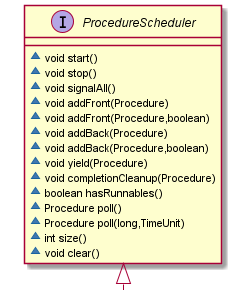
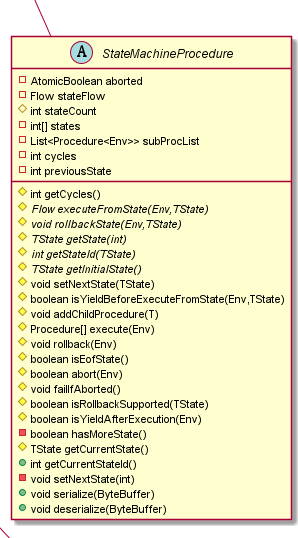

# Procedure模块功能设计

## 1.背景

## 2.概要描述

主要功能类包括四个部分：

* ProcedureExecutor (executor)：
	用于处理客户端请求，提供任务提交、查询、中止功能
	
	向scheduler提交与执行Procedure
	
	通过store持久化Procedure
	
	主要包含以下数据结构：
	
	Environment：Procedure执行的环境，用于和其他进程通信
	
	WorkerThreadPool：worker线程池，worker异步执行scheduler中的任务
	
	RootProcedureStack：hashMap+Stack的形式，用于维护任务之间的父子关系，保证执行与回滚的顺序一致
	
	CompletedProcedureRetainer：存储已完成的任务，提供查询与定时清理功能
	
* ProcedureScheduler (scheduler)

  队列，主要用于实现任务的调度，并且结合

* ProcedureStore ()：

​		用于持久化Procedure对象，实现故障恢复

整体流程如图所示：

1. 客户端提交任务至executor
2. executor将任务push至scheduler
3. 返回procid至客户端
4. workerThread从队列中取出任务（异步）
5. workerThread执行任务（异步）
6. workerThread更新任务状态，并持久化（异步）


## 3.详细设计

### 3.1 类与接口设计

#### 3.1.1 Procedure


Procedure抽象类，用于描述一个具体的任务。

必须实现的抽象方法包括execute, rollback，abort

```java
Procedure<Env> execute(Env)//任务执行方法，用于实现任务的业务逻辑。
void rollback(Env)：任务回滚时执行，用于实现任务失败后回滚的逻辑。
boolean abort(Env)：用于实现接收到中止命令时，需要进行的业务逻辑。
```

此外，提供了其他方法，用户可以根据需要进行重写实现。

```java
void acquireLock(Env)                //实现锁机制，获取锁
void releaseLock(Env)                //实现锁机制，释放锁
boolean holdLock(Env)                //实现锁机制，是否持有锁
void beforeRecover(Env)              //任务从磁盘恢复前处理
void afterRecover(Env)				 //任务从磁盘恢复后处理
void completionCleanup(Env)          //任务执行完成后处理
boolean isYieldAfterExecution(Env)   //是否允许执行权让出
boolean isYieldAfterExecution(Env)   //是否允许执行权让出
boolean setTimeoutFailure(Env)       //超时后处理
```

#### 3.1.2 ProcedureExecutor


ProcedureExecutor是任务调度框架的核心，主要用于实现具体的任务调度功能。下面详细讲解其内部结构。

1.Map<Long，ReentrantLock> idLockMap

用于维护id的对象锁，防止同一个任务被多次提交。

2.Map<Long，Procedure> procedures

任务对象的索引

3.WorkerThread，WorkerMonitorExecutor

二者共同实现了一个轻量的线程池，初始化时需要指定其核心线程数与最大线程数。

WorkerThread用于异步执行如下：

```java
public void run() {
  long lastUpdated = System.currentTimeMillis();
  try {
    while (isRunning() && keepAlive(lastUpdated)) {
        //从队列中取出一个Procedure
      Procedure<Env> procedure = scheduler.poll(keepAliveTime, TimeUnit.MILLISECONDS);
      if (procedure == null) {
        continue;
      }
      ...
      ReentrantLock idLock =
          idLockMap.computeIfAbsent(procedure.getProcId(), id -> new ReentrantLock());
        //加锁
      idLock.lock();
        //执行任务
      executeProcedure(procedure);
     ...
    }

  } catch (Throwable throwable) {
    LOG.warn("Worker terminated {}", this.activeProcedure, throwable);
  } finally {
      //释放锁
    idLock.unlock();  
    LOG.debug("Worker teminated.");
  }
  //临时线程keepAlive结束后执行，核心线程不会执行
  workerThreads.remove(this);
}
```

WorkerMonitorExecutor定时轮询检查WorkerThread是否存在stuck的情况，如果stuck线程数超过阈值，则创建带KeepAlive的临时线程，用于执行队列中其他任务。

4.Map<Long，CompletedProcedureRetainer> completed， CompletedProcedureCleaner

任务执行完毕后，会从procedures转移至completed，CompletedProcedureCleaner会周期执行检查completed清理过期的任务。

5.Map<Long，RootProcedureStack> rollbackStack，用于实现回滚机制

对于每个通过客户端提交上来的Procedure，称为RootProcedure，而在执行过程中产生的Procedure，成为SubProcedure。RootProcedureStack用于维护每个RootProcedure下所有子Procedure。


#### 3.1.3 ProcedureScheduler



ProcedureScheduler提供Procedure的调度功能，目前的实现是一个简单的阻塞队列。后续可以对任务（如按照业务类型分为DataRegion任务和SchemaRegion任务）进行分类，实现一个支持优先级策略的调度。

#### 3.1.4 ProcedureStore


ProcedureStore用于持久化Procedure内容到磁盘，用于重启恢复。当前为最简单的实现：每一个procid对应一个id.proc.wal文件，当需要更新状态时，使用buffer写入临时文件，再整个进行替换。

#### 3.1.5 StateMachineProcedure



StateMachineProcedure用于实现自定义任务状态。除了7种固定的Procedure状态，用户可以自定义任务状态，例如STEP1，STEP2，然后实现抽象方法executeFromState()，rollbackState()，实现状态直接的转换。

重要的属性与方法包括：

subProcList与addChildProcedure()，用于添加子任务

int circle和previousState，当执行状态不变时（“原地踏步”），circle会自增，可以用于设置break，防止stuck。

executeFromState()，抽象方法，用于实现自定义状态流转，多为一个Switch case结构

rollbackState()，抽象方法，用于实现自定义状态的回滚

isRollbackSupported()，定义是否支持回滚，如果是，则失败后会走到ROLLEDBACK状态；否则则会进行重试，直至另一个中止状态(SUCCESS/ROLLEDBACK)

#### 3.1.6 完整类图


### 3.2 Procedure执行流程

#### 3.2.1 Procedure生命周期与状态流转

Procedure包含以下7中状态，状态之间的流转关系，如下图所示。

```thrift
INITIALIZING  = 1,              
RUNNABLE  = 2,                  
WAITING = 3,
WAITING_TIMEOUT = 4,
ROLLEDBACK = 5,
SUCCESS = 6,                    
FAILED = 7                        
```


1. 客户端提交Procedure，服务端反序列化后得到Procedure对象proc，初始化状态为INITIALIZING 

2. 服务端ProcedureExecutor执行submitProcedure(proc)，proc加入ProcedureSchedure，状态为RUNNABLE

WorkerThread将schedure中状态为RUNNABLE的任务proc取出，执行proc.doExecute()中用户自定义的业务逻辑。

​		用户根据doExecute()的执行情况去设置下一步的状态

> 设置为SUCCESS，任务执行成功，更新store，执行清理操作，结束。
>
> 设置为FAILED，任务执行失败，执行proc.doExecute()回滚逻辑，根据回滚执行结束后，可以将其设置为ROLLEDBACK状态。
>
> 设置为ROLLEDBACK，任务已回滚，更新store，执行清理操作，结束。
>
> 设置为WAITING_TIMEOUT，则会将任务加入超时队列，等待周期线程进行重新调度，需要设置setTimeoutFailure方法，默认操作为中止任务。

3. 可以使用proc.doExecute()方法的返回值， 设置子任务subProc。doExecute()执行完成后，会自动提交这些子任务。此时，父任务状态设置为WAITING。直到所有子任务都执行完，才会设置为RUNNABLE，重新执行。

#### 3.2.2 ProcedureExecutor:executeProcedure()执行过程

WorkerThread从调度中拿到proc后，调用ProcedureExecutor:executeProcedure(proc)执行

```pseudocode
if proc执行完成
	return
end if	
获取proc的RootRollbackStack stack
do
   if 执行rootProcStack.acquire(),stack状态为FAILED
	  开始回滚
	  if 子任务已全部执行
		 依次回滚stack中所有任务
	  else
         回滚自己
      回滚执行完毕，退出循环
      end if
   else
      获取任务锁
         执行任务（执行过程中，如果任务失败，会将stack置为FAILED）
      释放锁
      stack.release()
      判断任务状态
   end if   
while stack状态是否为FAILED, 如果为FAILED，则进入循环，执行回滚
```

#### 3.2.3 ProcedureExecutor:executeRootStackRollback()执行过程

在3.2.2中，rootRollbackStack中任意一个proc失败，都会使stack状态置为FAILED。下图为RootProcedureStack的类图。


包含：

State state，用于标记栈的状态，当栈中的任一子任务执行失败，则栈的状态会置为Failed，即开始回滚该RootProc下所有的SubProc。

ArrayList<Proc> subprocStack，用于实现栈的功能。执行时，从头部添加，回滚时，从尾部读取。

int running，用于实现一个轻量级的CountdownLatch，通过acquire和release控制，保证栈中所有的subproc都执行后，state才能进入下一个状态。

当stack状态为FAILED，且stack下running为0，即所有子任务都执行完毕时，则开始回滚整个rollbackStack，其执行逻辑如下：

```pseudocode
获取proc执行的异常，由root开始，遍历rollbackStack。
将rootProc设置为FAILED，更新store
loop subprocStack（从尾部开始）
	if proc执行成功
		从subprocStack移出
		更新store
		continue;
	end if	
	对于其他状态的任务（RUNNABLE/FAILED）
		获取任务锁
			proc.doRollback()
			清空任务回滚位置的记录
			状态置为ROLLEDBACK
			if proc存在父任务
				删除自己
			else
				删除自己的子任务
			end if	
		释放任务锁
	if proc不是root任务
		执行proc.completionCleanup()
	end if
end loop
所有子任务已回滚，清理根任务
```

3.3 ProcedureExecutor重启恢复过程

ProcedureExecutor初始化时，会进行恢复，加载磁盘上的Procedure文件信息。恢复的过程如下：


```pseudocode
读取磁盘中的文件，得到一个ProcedureList，procId倒序排序，保证子任务在父任务前面。
loop Proc in ProcedureList
	if Proc 已经执行完毕
		在completed中，添加该Proc 
	else
		if proc是rootProc
			在rollbackStack中创建一个entry
        end if
    end if
    统计各个状态Procedure数量
end loop
新建各个状态ProcedureList，runnableList，failedList，waitingList，waitingTimeoutList
loop proc in ProcedureList
	if proc已完成且proc是rootProc
		continue;
	end if
	if proc存在父任务
		父任务childLatch++
	end if
	加载rootProc的rollbackStack
	根据proc的状态放入对应的list
end loop
//1 恢复处于waiting的任务
loop proc in waitingList
	if proc有子任务 //说明存在子任务，父任务等待子任务运行完后，重试
		proc状态设置为RUNNABLE
		runnableList.add(proc)
	else
		proc.afterRecover()
	end if
 end loop
 恢复任务锁
 //2 恢复超时的proc
 loop proc in waitingTimeoutList
 	timeoutExecutor.add(proc) //等待周期调度
 end loop
 
 //3 恢复失败的proc
 loop proc in failedList
 proc.afterRecover()
 	scheduler.addBack(proc) //直接加入队尾，等待回滚
 end loop
 //4 恢复RunnableList
 loop proc in runnableList
 	proc.afterRecover()
 	scheduler.addBack(proc)
 end loop
全部添加到scheduler后，唤醒scheduler 
```

## 4 讨论

### 4.1 节点部署问题

 当前Procedure的设计作为一个单独的节点，实现了一套thrift-server-client，提供服务。初始化的过程中，需要考虑DataNode是否上线。即初始时，procedureScheduler处于恢复后挂起的状态，当DataNode上线后，才能对外提供服务。

​	    考虑到其生命周期与configNode基本一致，是否考虑可以和confignode部署在同一节点上。这样就可以省去DataNode状态检测这一步骤。且对于节点资源的利用也更好一些。

### 4.2 删除流程问题

关于存储组/时序的删除流程，是否需要使用Procedure进行开发？
